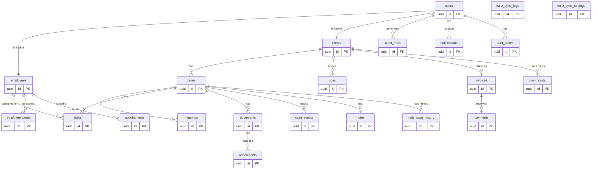

# تصميم قاعدة البيانات (Database Schema & ERD) لنظام إدارة مكاتب المحاماة

تحتوي هذه الوثيقة على التصميم الاحترافي والكامل لهيكل قاعدة البيانات ومخطط العلاقات (ERD) لنظام إدارة المحاماة، مبني ليتوافق مع تخصيصات Supabase PostgreSQL ويدعم التكامل التام مع بوابة "ناجز" وفق المتطلبات المحددة.

## مخطط العلاقات (ERD - Entity Relationship Diagram)

---

## تفاصيل الجداول (Schema Details)

*ملاحظة: جميع الجداول تحتوي على الحقول الافتراضية التالية:*
- `id`: UUID (Primary Key, Default: `uuid_generate_v4()`)
- `created_at`: Timestampz (Default: `now()`)
- `updated_at`: Timestampz (Default: `now()`)

### 1. العملاء (`clients`)
| Name | Type | Description / Indexes |
|-------------|---------|-----------------------|
| `name` | String | اسم العميل/الشركة |
| `id_number` | String | رقم الهوية الوطنية / السجل التجاري (مطابق لـ national_id في الكود) |
| `is_company`| Boolean | تحديد نوع العميل (فرد/شركة) |
| `phone` | String | رقم الجوال (Indexed) |
| `email` | String | البريد الإلكتروني |
| `address` | Text | العنوان التفصيلي |
| `status` | String | حالة الحساب (نشط، إلخ) |
| `najiz_id` | String | معرّف العميل في ناجز لمنع التكرار (Indexed) |
| `portal_token` | String | توكن تسجيل الدخول لبوابة العملاء |
| `portal_link` | String | رابط البوابة الفرعية للعميل |
| `portal_username` | String | اسم المستخدم لتسجيل دخول الموكل |
| `portal_password` | String | كلمة مرور الموكل للبوابة |
| `active_portal` | Boolean | حالة تفعيل البوابة |
| `permitted_cases` | JSONB | القضايا المصرح للموكل برؤيتها |
| `permitted_case_permissions` | JSONB | صلاحيات الموكل في البوابة |

### 2. القضايا (`cases`)
| Name | Type | Description / Indexes |
|-------------|---------|-----------------------|
| `client_id` | UUID | (FK -> clients.id) (Indexed) |
| `case_number` | String | رقم القضية الأساسي (Indexed) |
| `najiz_case_number`| String | رقم القضية في ناجز (Unique/Indexed للدمج) |
| `title` | String | عنوان القضية (caseName في الكود) |
| `category` | String | التصنيف (تجاري، عمالي، إلخ) |
| `stage` | String | المرحلة (ترافع، استئناف، تنفيذ) |
| `status` | String | الحالة الحالية |
| `priority` | String | درجة الأهمية (high, normal, low) |
| `court_name`| String | جهة التقاضي |
| `opponent_name`| String | اسم الخصم |
| `summary` | Text | خلاصة القضية |
| `details` | Text | تفاصيل إضافية |
| `attachments_count`| Integer | عدد المرفقات |
| `last_session_at` | Timestampz | تاريخ آخر جلسة |
| `next_session_at` | Timestampz | تاريخ الجلسة القادمة |
| `lawyers` | JSONB | مصفوفة أسماء أو معرفات المحامين المسندة |
| `metadata` | JSONB | حقول إضافية غير مهيكلة من ناجز |
| `najiz_case_id` | String | معرف القضية الداخلي في ناجز |
| `subject` | String | موضوع الدعوى |
| `case_classification`| String | تصنيف الدعوى التفصيلي |
| `case_status` | String | حالة الدعوى في ناجز |
| `opponent_id` | String | رقم هوية الخصم |
| `opponent_national_id`| String | الهوية الوطنية للخصم |
| `circuit_number` | String | رقم الدائرة القضائية |
| `power_of_attorney_number`| String | رقم الوكالة الشرعية للدعوى |
| `next_session_time` | String | وقت الجلسة القادمة (أمثلة: 10:15 ص) |
| `is_najiz_sync`| Boolean | هل هي مزامنة مع ناجز |
| `is_confidential`| Boolean | هل القضية سرية |
| `confidentiality` | String | تصنيف السرية |
| `archived` | Boolean | هل تمت أرشفتها |
| `last_activity_at` | Timestampz | تاريخ آخر نشاط |
| `start_date` | Date | تاريخ بداية الترافع |
| `judge_name` | String | اسم القاضي ناظر الدعوى |
| `execution_number` | String | رقم طلب التنفيذ المرتبط |
| `execution_amount` | Decimal | قيمة مبالغ التنفيذ |
| `agreed_fees` | Decimal | الأتعاب المتفق عليها |
| `collected_fees` | Decimal | الأتعاب المحصلة |
| `expenses` | Decimal | المصاريف القضائية المدفوعة |

### 3. الجلسات (`hearings`)
| Name | Type | Description / Indexes |
|-------------|---------|-----------------------|
| `case_id` | UUID | (FK -> cases.id) (Indexed) |
| `date` | Date | تاريخ الجلسة (Indexed) |
| `time` | String | وقت الجلسة |
| `location` | String | موقع الجلسة (عن بعد / اسم المحكمة) |
| `hall` | String | قاعة الجلسة أو اسم الدائرة |
| `judge` | String | اسم القاضي |
| `status` | String | حالة الجلسة (upcoming, completed, canceled) |
| `notes` | Text | مذكرات الجلسة |

### 4. الموظفين (`employees`)
| Name | Type | Description / Indexes |
|-------------|---------|-----------------------|
| `name` | String | اسم الموظف الكامل |
| `role` | String | دور الموظف الافتراضي (admin, lawyer, employee) |
| `email` | String | البريد الإلكتروني |
| `phone` | String | رقم الجوال |
| `status` | String | حالة الموظف (نشط، في إجازة، مستقيل) |
| `salary` | Decimal | الراتب الصافي الحالي |
| `department`| String | القسم |
| `join_date` | Date | تاريخ الانضمام للمكتب |
| `national_id`| String | رقم الهوية الوطنية أو الإقامة (Unique) |
| `username` | String | اسم مستخدم فريد لتسجيل الدخول لبوابة الموظف |
| `password` | String | كلمة المرور للدخول لبوابته |
| `custom_login_token`| String | توكن الدخول التلقائي والمصادقة |
| `portal_link` | String | الرابط المباشر لبوابة الموظف الفرعية |
| `qualification` | String | المؤهل العلمي والدرجة الأكاديمية |
| `birth_date` | Date | تاريخ الميلاد |
| `manager` | String | المدير المباشر المسؤول |
| `nationality`| String | جنسية الموظف |
| `national_id_expiry`| Date | تاريخ انتهاء صلاحية الهوية/الإقامة |
| `start_date` | Date | تاريخ مباشرة العمل الفعلي |
| `end_date` | Date | تاريخ نهاية الخدمة إن وجد |
| `branch` | String | فرع العمل والتبعية الجغرافية |
| `allowances` | Decimal | إجمالي البدلات الشهرية (سكن، انتقال، أخرى) |
| `deductions` | Decimal | إجمالي الخصومات والتأمينات الاجتماعية |
| `base_salary`| Decimal | الراتب الأساسي قبل البدلات والخصم |
| `job_title` | String | المسمى الوظيفي المهني التفصيلي |
| `najiz_api_key`| String | مفتاح الربط والربط التلقائي بناجز الخاص بالموظف |
| `assigned_cases` | JSONB | قائمة معرفات القضايا المسندة لمتابعته |
| `assigned_clients` | JSONB | قائمة الموكلين التابعين له |
| `permissions`| JSONB | الصلاحيات الإجرائية الممنوحة |
| `feature_access`| JSONB | الميزات المصرح له باستخدامها |
| `sidebar_config`| JSONB | الأقسام التي تظهر له في الشريط الجانبي |
| `avatar_url` | String | رابط الصورة الشخصية |
| `employee_code`| String | الكود الوظيفي التعريفي للمكتب |

### 5. المستخدمين (`users`)
*(مرتبط بنظام مصادقة Supabase Auth).*
| Name | Type | Description / Indexes |
|-------------|---------|-----------------------|
| `id` | UUID | مرتبط بـ `auth.users` |
| `role` | String | دور المستخدم الفعلي (admin, user) |

### 6. المهام (`tasks`)
| Name | Type | Description / Indexes |
|-------------|---------|-----------------------|
| `case_id` | UUID | (FK -> cases.id, Nullable) (Indexed) |
| `employee_id`| UUID | (FK -> employees.id, Nullable) |
| `title` | String | عنوان المهمة |
| `description`| Text | تفاصيل المنجز المطلوب |
| `status` | String | (todo, in_progress, review, completed) |
| `priority` | String | الأولوية (high, normal, low) |
| `due_date` | Date | تاريخ تسليم الاستحقاق |
| `assigned_to`| String | اسم الموظف المسندة إليه |
| `case_number`| String | رقم القضية المرتبطة |
| `timer_active`| Boolean | مؤشر تشغيل مؤقت العمل |
| `timer_duration`| Integer | عدد الثواني المسجلة للمهمة |
| `target_completion_time`| String | الوقت المستهدف للتسليم |

### 7. الوكالات القضائية (`powers_of_attorney`)
| Name | Type | Description / Indexes |
|-------------|---------|-----------------------|
| `client_id` | UUID | (FK -> clients.id) |
| `poa_number`| String | رقم الوكالة الشرعية الصادرة (Unique) |
| `issue_date`| Date | تاريخ الإصدار |
| `expiry_date`| Date | تاريخ الانتهاء الصلاحية |
| `type` | String | نوع الوكالة (عامة، خاصة، مخصصة) |
| `status` | String | حالة الوكالة (active, expired, revoked) |
| `file_url` | String | رابط نسخة الوكالة السحابي |

### 8. المستندات (`documents`)
| Name | Type | Description / Indexes |
|-------------|---------|-----------------------|
| `case_id` | UUID | (FK -> cases.id, Nullable) |
| `client_id` | UUID | (FK -> clients.id, Nullable) |
| `name` | String | اسم المستند أو الوثيقة |
| `category` | String | تصنيف المستند (لائحة جوابية، عقد، تقرير) |
| `file_url` | String | رابط التخزين السحابي للملف |
| `file_size` | String | حجم الملف التفصيلي |
| `size` | Integer | حجم الملف بالبايت |
| `storage_path`| String | المسار الداخلي بالـ storage bucket |
| `uploaded_at`| Timestampz | تاريخ الرفع |
| `tags` | JSONB | وسوم التصنيف والتصفية |
| `content_text`| Text | المحتوى النصي المفهرس للبحث الذكي |
| `ai_classification`| String | تصنيف الذكاء الاصطناعي للمستند |

### 9. طلبات التنفيذ (`executions`)
| Name | Type | Description / Indexes |
|-------------|---------|-----------------------|
| `execution_number`| String | رقم طلب التنفيذ الصادر (Unique) |
| `case_number`| String | رقم القضية الأساسي المرتبط |
| `requester_name`| String | اسم طالب التنفيذ (الموكل) |
| `opponent_name`| String | اسم المنفذ ضده (الخصم) |
| `status` | String | حالة الطلب (نشط، مكتمل، إلخ) |
| `amount` | Decimal | مبالغ التنفيذ المطالب بها |
| `court_name`| String | محكمة التنفيذ المختصة |
| `issue_date`| Date | تاريخ تقديم الطلب |
| `last_update`| Date | تاريخ آخر تحديث لحالة الطلب |
| `details` | Text | تفاصيل القرارات الصادرة (أمثلة: قرار 34/46) |

### 10. المصاريف القضائية (`expenses`)
| Name | Type | Description / Indexes |
|-------------|---------|-----------------------|
| `description`| String | بيان وتفاصيل المصروف القضائي |
| `amount` | Decimal | قيمة المصروف |
| `category` | String | تصنيف المصروف (رسوم دعوى، خبرة، إعلانات) |
| `date` | Date | تاريخ الدفع الصادر |
| `case_number`| String | رقم القضية المرتبطة |

### 11. المحادثات والرسائل (`messages`)
| Name | Type | Description / Indexes |
|-------------|---------|-----------------------|
| `sender` | String | معرف أو كود المرسل (system, client, lawyer) |
| `sender_name`| String | اسم مرسل الرسالة |
| `text` | Text | محتوى نص الرسالة المتبادلة |
| `timestamp` | Timestampz | وقت إرسال الرسالة بدقة |
| `case_number`| String | رقم القضية المرتبطة بالمحادثة |

### 12. عقود الترافع والاتفاقيات (`contracts`)
| Name | Type | Description / Indexes |
|-------------|---------|-----------------------|
| `client_name`| String | اسم العميل/الطرف الثاني كلياً |
| `client_id` | UUID | (FK -> clients.id, Nullable) |
| `title` | String | عنوان العقد أو اتفاقية الأتعاب |
| `content` | Text | البنود الكاملة والصيغة القانونية للعقد |
| `status` | String | حالة العقد (draft, pending_signature, signed, active) |
| `otp_code` | String | رمز التحقق الصادر للتوقيع الإلكتروني |
| `otp_status` | String | حالة التحقق (verified, pending) |
| `signed_at` | Timestampz | تاريخ التوقيع الفعلي للعميل |
| `signer_name`| String | اسم موقع الاتفاقية الثنائي |
| `phone` | String | رقم هاتف التحقق للتوقيع |

### 13. سجل أخطاء النظام (`system_errors`)
| Name | Type | Description / Indexes |
|-------------|---------|-----------------------|
| `message` | Text | رسالة الخطأ الملتقطة |
| `stack` | Text | تفاصيل التعقب ومسار الأكواد/تعليمات SQL للإصلاح |
| `component` | String | المكون البرمجي مسبب الخطأ (مثال: Supabase RLS Guard) |
| `user_id` | UUID | (FK -> users.id, Nullable) |
| `severity` | String | درجة خطورة العطل (error, warning, info) |

---
## قواعد وسياسات المزامنة مع "ناجز" وفق المتطلبات (Najiz Sync Rules)
1. **لا يتم حذف البيانات نهائياً**: أي قضية، جلسة، أو صك قادم من ناجز لا يُحذف بل يُؤرشف أو تُغيّر حالته إلى `archived` / `closed`.
2. **الدمج بدلاً من التكرار (Merge / Upsert)**: عند مزامنة القضايا، يتم البحث بواسطة `najiz_case_number`. إذا كان موجوداً يتم عمل (Update) للحقول التي تغيرت فقط. إذا لم يكن موجوداً يتم عمل (Insert).
3. **أولوية البيانات (Source of Truth)**: إذا أُضيفت قضية يدوياً `is_manual = true`، ثم تم استيرادها من ناجز، يتم ربط الجلسات وتحديث الحقول تلقائياً لتصبح `is_najiz_sync = true` مع الاحتفاظ بالتعديلات المحلية.
4. **التاريخ (History Track)**: في كل مرة تتغير فيها بيانات أو حالة قضية قادمة من ناجز، يتم تسجيل نسخة من الـ Payload القديم في جدول `najiz_case_history` لضمان عدم ضياع التحديثات.

